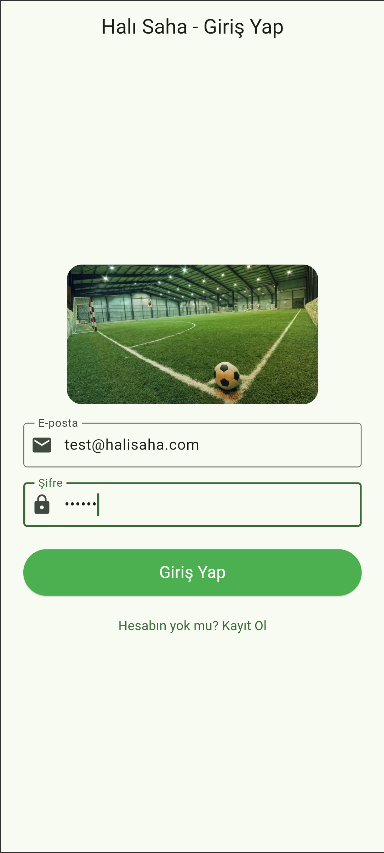
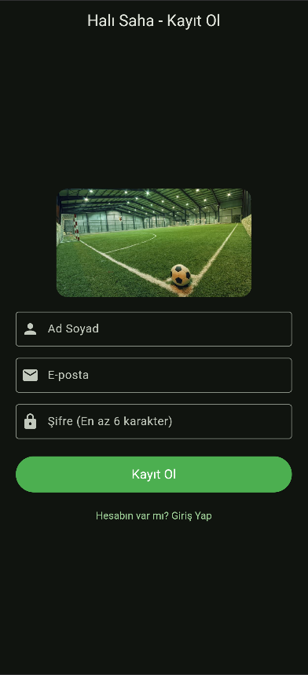
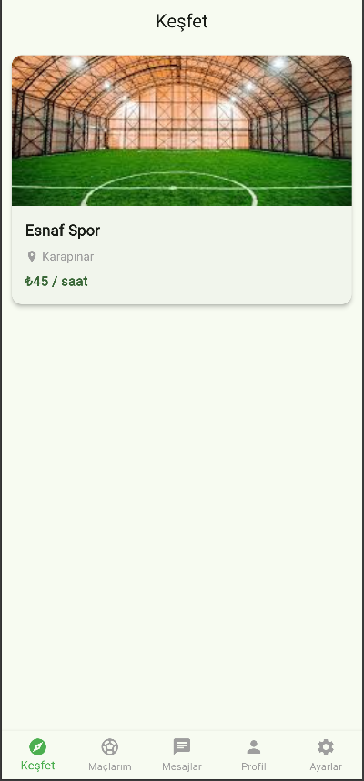
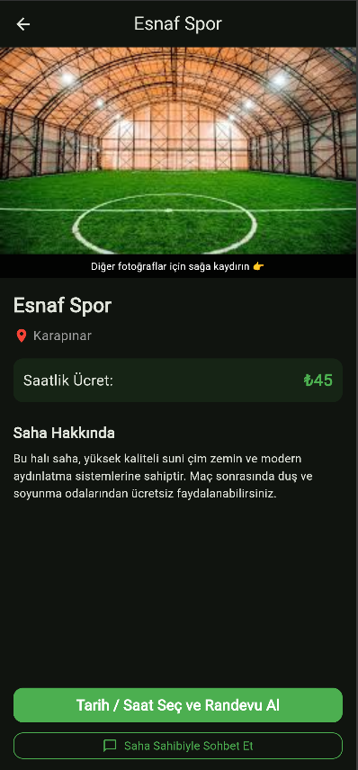
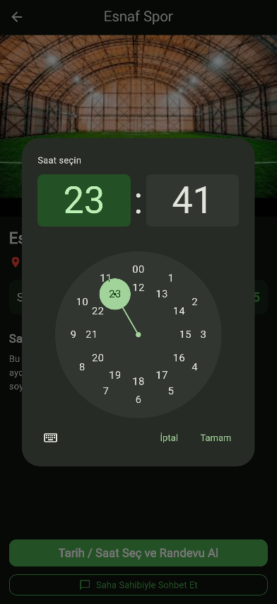
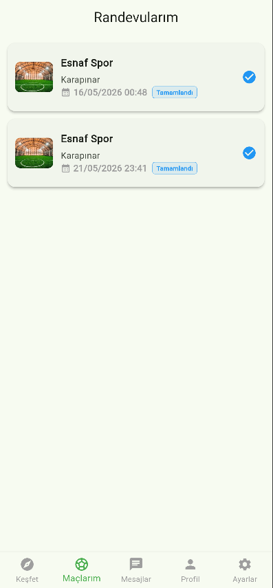
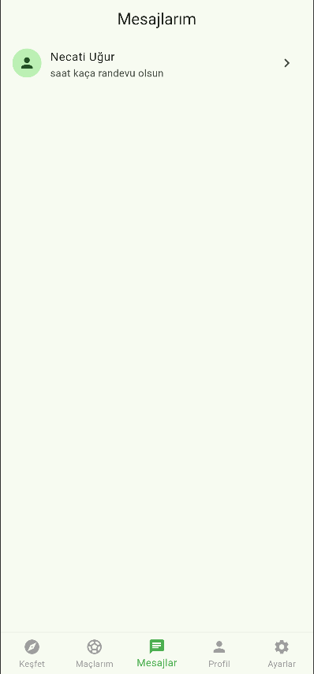
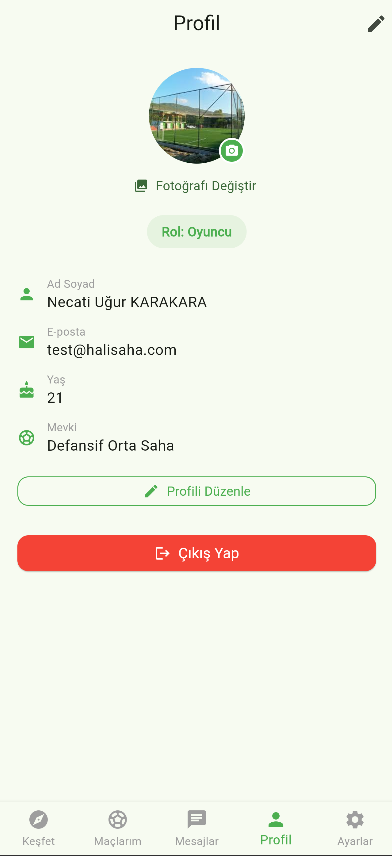
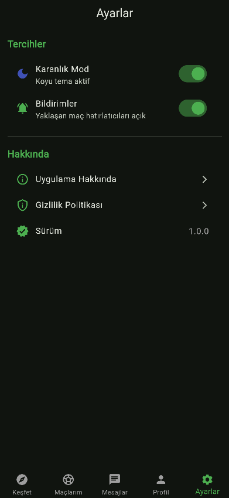

# Maç Organizasyon (Halı Saha Rezervasyon Uygulaması)

Bu proje, Flutter ve Firebase kullanılarak geliştirilmiş profesyonel bir halı saha rezervasyon ve maç organizasyon uygulamasıdır.

## Öğrenci Bilgileri
- **Ad Soyad:** Necati Uğur KARAKARA
- **Öğrenci No:** 233301161

## Test Hesapları Bilgileri
Uygulamayı test edebilmeniz için iki farklı rol için önceden oluşturulmuş hesap bilgileri aşağıdadır:

- **Oyuncu (Normal Kullanıcı) Hesabı:**
  - E-posta: `test@halisaha.com`
  - Şifre: `123456`

  - E-posta: `test3@halisaha.com`
  - Şifre: `123456`

- **Saha Sahibi (Yönetici) Hesabı:**
  - E-posta: `test2@halisaha.com`
  - Şifre: `123456`

## Kullanılan Paketler
Projede kullanılan temel kütüphaneler (`pubspec.yaml`):
- `flutter_riverpod` (State Management / Durum Yönetimi)
- `firebase_core` & `firebase_auth` (Firebase Bağlantısı ve Kimlik Doğrulama)
- `cloud_firestore` (Veritabanı - Denormalize yapı ve loglama için)
- `firebase_storage` (Profil ve Saha fotoğrafları yükleme)
- `firebase_messaging` (Push Bildirimleri)
- `flutter_dotenv` (Güvenli Çevresel Değişkenler - .env yönetimi)
- `shared_preferences` (Kullanıcı cihazında yerel veri/ayar saklama)
- `image_picker` (Galeriden/Kameradan fotoğraf seçimi)
- `intl` & `flutter_localizations` (Tarih formatlama ve Türkçe dil desteği)

## Ekran Görüntüleri
Aşağıda uygulamanın temel akışını gösteren ekran görüntüleri bulunmaktadır:

1. **Giriş ve Kayıt Ekranı:**

2. **Ana Sayfa (Keşfet) Ekranı:**

3. **Saha Detay ve Rezervasyon Ekranı:**

4. **Maçlarım Ekranı:**

5. **Mesajlar / Sohbet Ekranı:**

6. **Profil Ekranı:**

7. **Ayarlar ve Tema Ekranı:**

